# タスク依存関係グラフ

自動生成: 2026-05-17 14:28 JST

ステータス色: 緑=done / 黄=in_progress / 青=review / 白=pending / 赤=blocked

```mermaid
graph TD
  T-001["T-001<br/>第1回YouTube台本作成        # 題名<br/>hoshino_ritsu"]
  style T-001 fill:#ff9
  T-004["T-004<br/>AI NOWA 収益実証プロジェクト — Phase A〜D構成（撤退基準付き）<br/>arima_reiji"]
  style T-004 fill:#ff9
  T-011["T-011<br/>Zenn記事v0.3執筆「初めて社員が本当に衝突した日」<br/>hoshino_ritsu"]
  style T-011 fill:#9cf
  T-007["T-007<br/>Zenn有料記事「AIチームの設計記録 実装ガイド」制作・出荷<br/>hoshino_ritsu"]
  style T-007 fill:#ff9
  T-012["T-012<br/>Webサイト公開用 法的3点セット作成（プライバシーポリシー・免責・運営者情報）<br/>saegusa_mio"]
  style T-012 fill:#ff9
  T-013["T-013<br/>T-004 週次レビュー可視化（累計売上 / 累計PV / 累計購入数）<br/>asakura_noa"]
  style T-013 fill:#9cf
  T-014["T-014<br/>Cloudflareサイト構築（ドメイン + 静的サイト立ち上げ）<br/>shirase_kai"]
  style T-014 fill:#ff9
  T-015["T-015<br/>サイト記事10本計画策定<br/>hoshino_ritsu"]
  style T-015 fill:#9cf
  T-016["T-016<br/>YouTube / Shorts 投稿フロー設計<br/>kuroba_yuu"]
  style T-016 fill:#fff
  T-017["T-017<br/>診断系コンテンツ テーマ選定<br/>kuroba_yuu"]
  style T-017 fill:#ff9
  T-006["T-006<br/>有料商材化のための法務整備<br/>saegusa_mio"]
  style T-006 fill:#f99
  T-010["T-010<br/>Zenn公開URL取得（単発初期設定）<br/>?"]
  style T-010 fill:#9f9
  T-009["T-009<br/>GitHub初見導線の詰まり解消（README改善）<br/>?"]
  style T-009 fill:#9f9
  T-008["T-008<br/>G4 GitHub Public化 + Zenn公開導線復旧<br/>?"]
  style T-008 fill:#9f9
  T-001["T-001<br/>Zenn記事v0.1公開<br/>?"]
  style T-001 fill:#9f9
  T-001-v02["T-001-v02<br/>Zenn記事v0.2公開<br/>?"]
  style T-001-v02 fill:#9f9
  T-002["T-002<br/>自律化切り分け表制作<br/>?"]
  style T-002 fill:#9f9
  T-003["T-003<br/>いくと非依存チャネルの読者価値評価軸設計<br/>?"]
  style T-003 fill:#9f9
  T-005["T-005<br/>読者価値フレーズ「結末が決まっていない実験を追える」各所反映<br/>?"]
  style T-005 fill:#9f9
  T-012 --> T-014
  T-015 --> T-016
```

## ボトルネック候補（多くのタスクから依存される）

- **T-012**: 1 タスクが依存 （status=in_progress, owner=saegusa_mio）
- **T-015**: 1 タスクが依存 （status=review, owner=hoshino_ritsu）

## 依存先未完了で実質ブロック中

- `T-014` (shirase_kai) is waiting for: T-012
- `T-016` (kuroba_yuu) is waiting for: T-015

